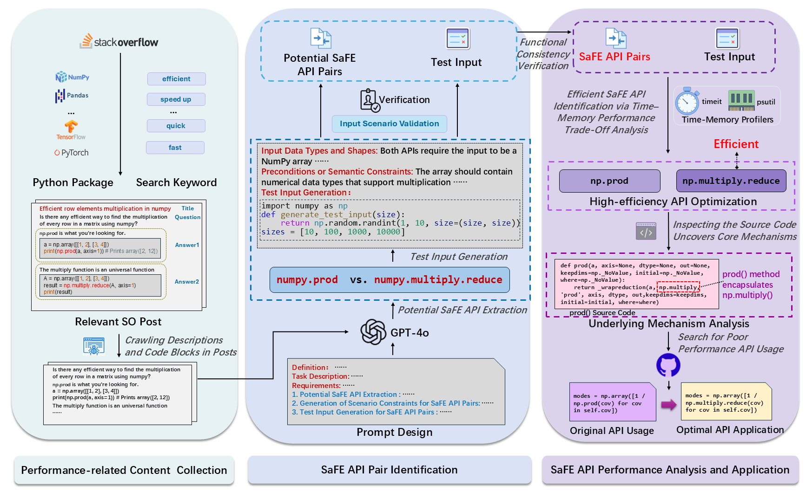

## SAFE-APIOpt

We propose **SaFE-APIOpt**, a method that identifies interchangeable API pairs which are functionally equivalent under specific usage scenarios, and evaluates their runtime and memory performance across data scales. The approach is language-agnostic, enabling systematic performance-aware API substitution across multiple programming languages.



## Scripts

### 1. fetch_so_posts.py

**Usage**

```
python fetch_so_posts.py <keyword> <tag> [--pagesize N] [--max-pages M]
```

- `<keyword>`: Search term for title/content
- `<tag>`: Single tag to add (the script automatically prepends `python;`)
- `--pagesize`: Number of results per page (default: 50)
- `--max-pages`: Maximum number of pages to fetch 
**Example**

```
python fetch_so_posts.py fast torch
```

→ Get links search with the keyword 'fast' for the torch library .And produces an Excel file named `python_torch_fast.xlsx`

------

### 2. so_answer_crawler.py

**Usage**

```
python so_answer_crawler.py <input_excel> [--output <output_excel>] [--delay SECONDS]
```

- `<input_excel>`: Path to Excel file (must contain `title` & `link` columns)
- `--output`: Output filename 
- `--delay`: Seconds to wait between requests

**Example**

```
python so_answer_crawler.py torch_fast.xlsx --output=torch_fast_answers.xlsx --delay=1.0
```

------

### 3. gpt.py

**Usage**

```
python gpt.py <input_excel> [--output <output_excel>]
```

- `<input_excel>`: Path to Excel 
- `--output`: Output filename (default: `generated_output.xlsx`)

**Example**

```
python gpt.py torch__fast_answers.xlsx --output=torch_potential_SaFE_API.xlsx
```

------

### 4. exec_example.py

**Usage**

```
python exec_example.py
```

In `exec_example.py`, we provide an example demonstrating the execution code for evaluating a SaFE API pair.The runtime and memory data for each input scale will be exported to `output.xlsx`


## RQ_Results

- The experimental results for **RQ1** are organized in the file *Evaluation_Case_Results_and_Categories.xlsx*.The table in *rq1_result.xlsx*  lists all the identified SaFE API pairs.
-  The experimental results for **RQ2** are compiled in the file *Underlying_Mechanism_Classification.xlsx*.
-  The experimental results for **RQ3** are documented in the four files: *All_Issues.xlsx*, *Developer’s_Negative_Issues.xlsx*, and *Developer's_Positive_Issues.xlsx*.
-  The experimental results for **RQ4** are documented in the file *R_Java_SaFE_API_Pairs.xlsx*. This file contains all the identified SaFE API pairs in Java and R

